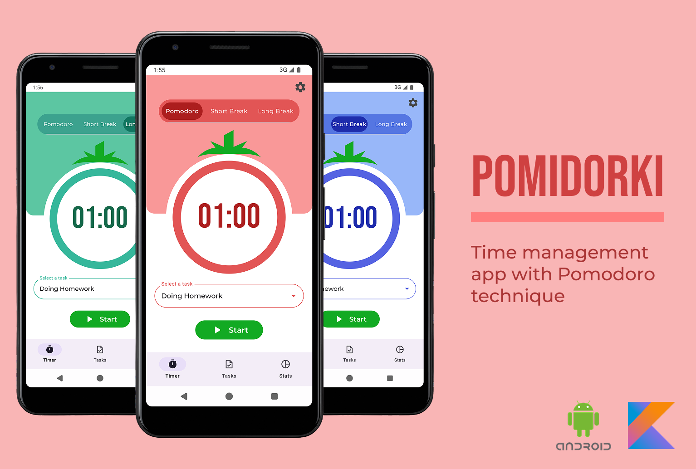

# Pomodorki

Time management Android application to focus on tasks effectively using The Pomodoro Technique, featuring a Foreground
service that allows users to handle the timer in the background, and enabling user to manage tasks.

## Ktlint

- Check formatting: `./gradlew ktlintCheck`
- Auto-format: `./gradlew ktlintFormat`
